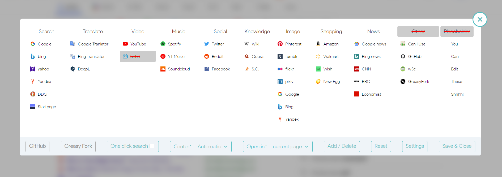

  

<a href='https://greasyfork.org/en/scripts/484068-searchenginejumpplus'> 
<a href='https://github.com/KParthSingh/SearchEngineJumpPlus/raw/master/searchEngineJump.user.js'>

## Description

SearchEngineJumpPlus-International is the international version of the [original SearchEngineJumpPlus](https://github.com/MUTED64/SearchEngineJumpPlus) It's a fork based on version 5.31.15. Originally created in Chinese for Chinese users, I have translated it into English. Additionally, I've added new websites relevant to international users and removed several Chinese ones.

This script works best with the [Select Text Link Like Opera script](https://greasyfork.org/en/scripts/789-select-text-inside-a-link-like-opera).

## Features

### Jump Search Page
Once the script is enabled in the Script Manager, the jump bar will appear on supported search pages, allowing you to quickly jump to the appropriate search engine and perform a one-click search based on the current search box contents.

### Crossword Search

When you visit other pages which don't support the search box, the script will enable the search function by default, when you select words on the page, a small bar will pop up at the top of the page, then you can click the button to jump to the corresponding search engine, and automatically perform a quick one-click search according to the content of the current search words.

### Dark Mode

The script supports dark mode, but different pages have different adaptation of dark mode, which leads to conflict between some websites that don't support dark mode and the default settings of operating system or browsers, so it is recommended to use it together with [Dark Reader Extension](https://darkreader.org/) to render dark pages according to the operating system settings automatically.

### Settings menu

At the end of the jump bar there is a settings button, click on it to enter the settings menu, or you can enter the settings menu from the options in the script manager. In the settings menu you can configure the search engine of the script, for example drag and drop to adjust the position, click to toggle the enabled status, add or remove search engines, etc.

## Current release 1.3

- fixes
  - Fixed theme detection for discord and twitter
  - Updated youtube icon
  - Some host changes
